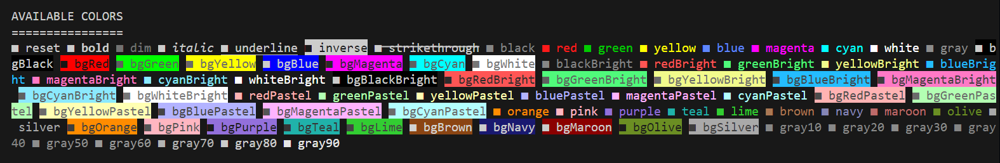

# Reliverse Relico

> @reliverse/relico is a themeable, chainable, typed, truecolor-powered terminal styling toolkit — built for humans, not just terminals. It makes your CLI output beautiful, accessible, and expressive — with developer-first ergonomics, smart config, and blazing-fast performance.

[sponsor](https://github.com/sponsors/blefnk) — [discord](https://discord.gg/Pb8uKbwpsJ) — [repo](https://github.com/reliverse/relico) — [npm](https://npmjs.com/@reliverse/relico)

## 🌟 Why Relico?

Because terminal styling shouldn’t feel like duct tape. **Relico** brings design-system-level polish to your CLI logs, banners, errors, and output — without battling your runtime, shell, or platform. Terminal styling should be *fun*, not frustrating. Relico makes it feel *right*.

- 🎨 **80+ built-in colors** — easily customize or override with your own [`HEX`](https://chatgpt.com/share/67fd24cd-e7b0-8008-a815-f33d01f33758) palette
- 🧩 **Themeable by default** — end-users can configure themes+typography+colors via `relico.config.ts`, developers via `await initUserConfig({ ... })`
- 🌈 **Smart color detection** — full support for truecolor (16M), 256-color, and fallback modes across environments
- 🦄 **A modern alternative** to `chalk`, `kleur`, `colorette`, `gradient-string`, and legacy console hacks
- 🧠 **Typed, chainable, DX-optimized** — with autocompletion, inline docs, and expressive API ergonomics
- 🌿 **Respects your environment** — including `NO_COLOR`, `FORCE_COLOR`, and terminal capabilities
- ⚡ **Blazing-fast & lightweight** — zero bloat, runtime-safe, build-time aware, minimal dependencies
- 🛡️ **Cross-platform & runtime-ready** — works everywhere — even when your users' terminals are weird — in Node.js, Bun, Deno, CI, Windows, macOS, Linux, Docker & more
- 🎯 **Precision-crafted ANSI output** — every color, reset, and style code is finely tuned for contrast, legibility, and glitch-free rendering — even in flaky terminals (as far as Node.js permits)
- 🦾 **Relico isn’t just about color** — it’s about communication — make your CLI users' output more than readable — make it feel *intentional*.



## Installation

```bash
bun add @reliverse/relico
# bun • pnpm • yarn • npm
```

## Configuration

**If you're end-user OR developer, create `relico.config.ts` in your root**:

```ts
import { defineConfig } from "@reliverse/relico";

export default defineConfig({
  colorLevel: 3, // 0 = off, 1 = basic, 2 = 256, 3 = truecolor
  theme: "primary", // or "secondary"
  customColors: {
    // ["primary", "secondary"]:
    blue: ["#5f87ff", "#5f87ff"],
    red: ["#ff5555", "#ff0000"],
    green: ["#00ff00", "#00cc00"],
  },
});
```

**If you're developer, initialize in your app (optional)**:

```ts
import { initUserConfig, re } from "@reliverse/relico";

// Use this to override Relico's 
// default settings for your app
// (relico.config.ts takes precedence)
await initUserConfig({ ... });
console.log(re.info("Custom config loaded!"));
```

## API Sneak Peek

```ts
import { re, colorize, rgb } from "@reliverse/relico";

console.log(re.red("Red!"));
console.log(re.bold(re.green("Bold green")));
console.log(colorize("magenta", "Hello!"));

console.log(rgb(250, 128, 114)("This is salmon"));
```

## Styles Available

### Text Colors

- `re.red("...")`, `re.blue("...")`, `re.greenBright("...")`, ...
- `re.gray("...")`, `re.whiteBright("...")`

### Backgrounds

- `re.bgRed("...")`, `re.bgBlueBright("...")`, ...

### Text Effects

- `re.bold("...")`, `re.italic("...")`, `re.strikethrough("...")`, ...

All styles are **composable**:

```ts
// Classic way:
re.bold(re.bgBlue(re.white("YEP!")));
// Chained way (recommended):
const boldRed = chain(re.bold, re.red); // go to "chain() Function Examples" section to learn more
console.log(boldRed("This text is bold and red"));
```

### Supported Colors, Backgrounds & Modifiers

| **Modifiers**   | **Base Colors**   | **Bright Colors** | **Pastel Colors** | **Extra Colors** | **Grayscale**     | **Backgrounds** | **Bright Backgrounds** | **Pastel Backgrounds** | **Extra Backgrounds** |
|---------------- |------------------ |------------------ |------------------ |------------------|------------------ |-----------------|----------------------- |----------------------- |---------------------- |
| `reset`         | `black`           | `blackBright`     | `redPastel`       | `orange`         | `gray10`          | `bgBlack`       | `bgBlackBright`        | `bgRedPastel`          | `bgOrange`            |
| `bold`          | `red`             | `redBright`       | `greenPastel`     | `pink`           | `gray20`          | `bgRed`         | `bgRedBright`          | `bgGreenPastel`        | `bgPink`              |
| `dim`           | `green`           | `greenBright`     | `yellowPastel`    | `purple`         | `gray30`          | `bgGreen`       | `bgGreenBright`        | `bgYellowPastel`       | `bgPurple`            |
| `italic`        | `yellow`          | `yellowBright`    | `bluePastel`      | `teal`           | `gray40`          | `bgYellow`      | `bgYellowBright`       | `bgBluePastel`         | `bgTeal`              |
| `underline`     | `blue`            | `blueBright`      | `magentaPastel`   | `lime`           | `gray50`===`gray` | `bgBlue`        | `bgBlueBright`         | `bgMagentaPastel`      | `bgLime`              |
| `inverse`       | `magenta`         | `magentaBright`   | `cyanPastel`      | `brown`          | `gray60`          | `bgMagenta`     | `bgMagentaBright`      | `bgCyanPastel`         | `bgBrown`             |
| `strikethrough` | `cyan`            | `cyanBright`      |                   | `navy`           | `gray70`          | `bgCyan`        | `bgCyanBright`         |                        | `bgNavy`              |
| `hidden`        | `white`           | `whiteBright`     |                   | `maroon`         | `gray80`          | `bgWhite`       | `bgWhiteBright`        |                        | `bgMaroon`            |
|                 | `gray`===`gray50` |                   |                   | `olive`          | `gray90`          |                 |                        |                        | `bgOlive`             |
|                 |                   |                   |                   | `olive`          |                   |                 |                        |                        | `bgSilver`            |

### Want to Get Only Certain Colors?

```ts
import type { DefaultColorKeys } from "@reliverse/relico";
const brandColors: DefaultColorKeys[] = ["magentaBright", "maroon"];
```

## Color Detection

Relico detects your terminal’s capability:

```ts
import { colorSupport } from "@reliverse/relico";

console.log(colorSupport.terminalName); // iTerm2, Windows Terminal, etc.
console.log(colorSupport.level); // 0, 1, 2, or 3
```

**Supports**:

- `NO_COLOR`
- `FORCE_COLOR=1` (or 0/2/3)

## Advanced Features

### Custom RGB + Hex

```ts
import { rgb, bgHex, hex } from "@reliverse/relico";

console.log(rgb(255, 105, 180)("Hot pink"));
console.log(bgHex("#1e90ff")("Dodger blue background"));
```

### Gradients & Rainbow

```ts
import { gradient, multiGradient, rainbow } from "@reliverse/relico";

console.log(rainbow("🎉 Woohoo!"));
console.log(gradient("From red to blue", "#ff0000", "#0000ff"));
```

## `chain()` Function

This function allows you to combine multiple color formatters into a single formatter function. This is useful for creating complex styles that apply multiple effects to text.

## Basic Usage

```typescript
import { re, chain } from "@reliverse/relico";

// Create a custom style that combines bold and red text
const boldRed = chain(re.bold, re.red);
console.log(boldRed("This text is bold and red"));

// Create a warning style with yellow text on a dark background
const warning = chain(re.yellow, re.bgBlack);
console.log(warning("Warning: This operation might take a while"));

// Chain three or more styles
const importantError = chain(re.bold, re.underline, re.red);
console.log(importantError("CRITICAL ERROR: System failure"));
```

## Creating Theme Combinations

```typescript
import { re, chain } from "@reliverse/relico";

// Create themed message styles
const successStyle = chain(re.bold, re.green);
const errorStyle = chain(re.bold, re.red);
const infoStyle = chain(re.blue, re.italic);
const warnStyle = chain(re.yellow, re.bold);

// Use them in your application
console.log(successStyle("✓ Operation completed successfully"));
console.log(errorStyle("✗ Failed to connect to server"));
console.log(infoStyle("ℹ Running in development mode"));
console.log(warnStyle("⚠ API rate limit approaching"));
```

## Custom RGB Combinations

```typescript
import { re, rgb, bgRgb, chain } from "@reliverse/relico";

// Create a custom color scheme with RGB values
const customHeader = chain(
  rgb(255, 105, 180), // Hot pink text
  bgRgb(25, 25, 25)   // Dark gray background
);

// Create a "danger" style with custom red and bold
const danger = chain(
  rgb(220, 20, 60),   // Crimson text
  re.bold,
  re.underline
);

console.log(customHeader(" SYSTEM STATUS "));
console.log(danger("Danger: High voltage detected!"));
```

## Multiline Text Handling

The `chain()` function automatically handles multiline text to prevent style leakage:

```typescript
import { re, chain } from "@reliverse/relico";

const highlight = chain(re.bgYellow, re.black, re.bold);

const multilineText = `This is line one
This is line two
This is line three`;

// Each line is properly wrapped with start/end codes
console.log(highlight(multilineText));
```

## Creating a Simple Logger

```typescript
import { re, chain } from "@reliverse/relico";

// Create logger styles
const styles = {
  info: chain(re.blue, re.bold),
  success: chain(re.green, re.bold),
  warning: chain(re.yellow, re.bold),
  error: chain(re.red, re.bold),
  debug: chain(re.magenta, re.dim)
};

// Simple logger implementation
const logger = {
  info: (msg) => console.log(styles.info("INFO"), msg),
  success: (msg) => console.log(styles.success("SUCCESS"), msg),
  warning: (msg) => console.log(styles.warning("WARNING"), msg),
  error: (msg) => console.log(styles.error("ERROR"), msg),
  debug: (msg) => console.log(styles.debug("DEBUG"), msg)
};

// Usage
logger.info("Application started");
logger.success("Data loaded successfully");
logger.warning("Cache expired, refreshing data");
logger.error("Failed to connect to database");
logger.debug("Request payload: " + JSON.stringify({id: 123}));
```

This allows you to create powerful, reusable style combinations for your terminal applications.

## Local Playground

```bash
git clone https://github.com/reliverse/relico
cd relico
bun i
bun dev
```

Check `example/e-mod.ts` for all the fun.

## Use Cases

- Beautiful CLI banners & success/error messages
- Colored logger outputs
- DX-enhanced terminal tools
- Custom internal design systems for CLIs

## Related

- [`chalk`](https://github.com/chalk/chalk) — the classic
- [`kleur`](https://github.com/lukeed/kleur) — performance-driven
- [`colorette`](https://github.com/jorgebucaran/colorette) — super tiny

Relico draws inspiration from all — and goes beyond them with modern configs, types, theming, and composability.

## 🛠 Contributing

We’d love your help! Bug? Feature? Example? PR it!  
Or hop into [Discord](https://discord.gg/Pb8uKbwpsJ) to discuss CLI theming and terminal art 💜

```bash
git clone https://github.com/reliverse/relico
cd relico
bun i
```

## License

MIT © [blefnk Nazar Kornienko](https://github.com/blefnk)  
Part of the [Reliverse](https://github.com/reliverse) ecosystem
